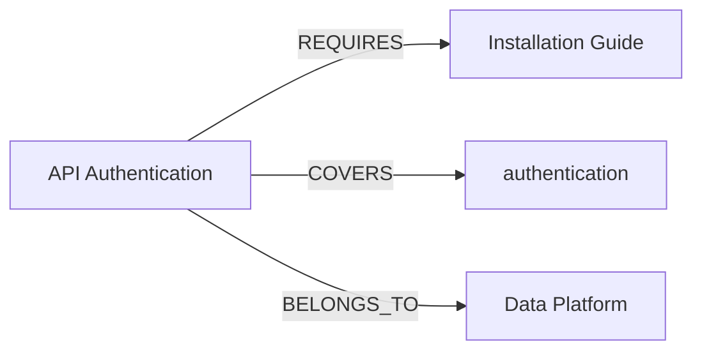

# From Taxonomy to Knowledge Graph: The IA's Path to AI-Ready Content

Every information architect already builds knowledge graphs. They just keep them implicit — trapped in a taxonomy tree, a metadata spreadsheet, and a pile of hand-maintained "related topics" links. Making that structure explicit is the difference between content an AI system can *retrieve* and content an AI system can *reason over*.

This is the companion to the [chunking deep-dive](chunking.md). Chunking decides whether a single passage carries its meaning. Knowledge graphs decide whether a passage carries its *relationships* — what it depends on, what it connects to, what it's part of.

## The ladder you're already climbing

If you do IA, you already work at two of the three levels of a knowledge graph. You may not have climbed the last rung yet.

| Level | What it is | You already do this as |
|---|---|---|
| **Taxonomy** | A hierarchy of topics | Your navigation tree and categories |
| **Ontology** | The rules: what types exist and how they may relate | Your content model and controlled vocabulary |
| **Knowledge graph** | The populated instance: real content as connected entities | *This is the rung most teams haven't formalized* |

A taxonomy tells you "API Authentication" lives under "Security." An ontology tells you an *API* has *endpoints*, requires *authentication*, and returns *responses* — the types and the allowed relationships. A knowledge graph is your actual documentation mapped onto that ontology: every topic, concept, and product wired together as nodes and edges.

## The atom: a triple

Everything in a knowledge graph reduces to one shape — the triple:

```
(subject) --predicate--> (object)
```

From a real documentation set, that looks like:

```
(API Authentication) --REQUIRES-->    (Installation Guide)
(API Authentication) --COVERS-->      (authentication)
(API Authentication) --BELONGS_TO-->  (Data Platform)
```

That's it. Three triples and you already know more about "API Authentication" than a flat metadata row could ever hold: what you must read first, what concept it teaches, and which product owns it. This triple model is what sits underneath both RDF (the W3C semantic-web standard) and property-graph databases like Neo4j. The vocabulary is shared even when the tools differ.

Drawn as a graph instead of a list, the same three triples look like this:



## What a graph answers that a taxonomy cannot

Here is the practical payoff. These are questions a hierarchy and a metadata table struggle with, and a graph answers by simply following edges.

### 1. The real learning path

Ask "what must a reader complete before Vector Search?" A taxonomy can't tell you — prerequisites aren't hierarchy. A graph traverses the `REQUIRES` edges and returns the ordered chain:

```
1. System Requirements
2. Installation Guide
3. Create an Account
4. Connect a Data Source
5. API Authentication
6. Querying Data
7. Vector Search
```

Nobody hand-authored that sequence. The graph derived it from individual prerequisite links.

### 2. Related content, without hand-linking

"Related topics" lists rot because humans maintain them manually. In a graph, two topics are related if they share a concept — the relationship is computed, not curated. Change a topic's concepts and its related set updates itself.

### 3. Content-gap signals for governance

Ask which concepts are covered by only one topic. Those are your thin spots — single points of failure in coverage that quietly degrade any AI answer touching them. The graph surfaces them for free, turning governance from a manual audit into a query.

## Why this matters now: GraphRAG

The reason knowledge graphs are having a moment is retrieval. Classic RAG embeds a question, grabs the top handful of similar chunks, and hands them to the model. The weakness is the same one the chunking article describes: a chunk arrives with no awareness of what it connects to.

**GraphRAG** fixes this by retrieving *connected* information. It finds the entry point, then traverses the graph to pull in the prerequisites and related topics the answer actually depends on.

The contrast, from a working demo:

**Flat RAG**, asked about "vector":
```
- Vector Search
```
One isolated topic. The model never learns you can't do vector search without first authenticating and connecting a data source.

**GraphRAG**, same question:
```
* Vector Search          (direct match)
  API Authentication     (pulled in by traversal)
  Connect a Data Source
  Create an Account
  Installation Guide
  Querying Data
  System Requirements
```
One chunk expanded into seven connected topics — the full context the answer depends on.

That is the entire thesis in one comparison. Structure gives a chunk its meaning. The graph gives a chunk its relationships. Together they are what "AI-ready content" actually means.

## Where the IA sits in all this

This is not a data-science discipline that happens to touch content. It is a content discipline that happens to use a graph. The person who should own the ontology — deciding what a "prerequisite" means, which concepts are canonical, how products relate to topics — is the information architect. The modeling judgment is IA judgment. The graph is just the format that makes it executable and lets an AI system traverse it.

## Getting started without boiling the ocean

You do not need a triplestore or a semantic-web certification to begin.

1. **Model, don't install.** Start with your existing taxonomy and metadata. Write out ten topics as triples on paper. If you can, you understand the core.
2. **Pick concepts as first-class nodes.** Your controlled vocabulary is already your concept layer — promote it from tags to nodes.
3. **Make prerequisites explicit.** The single highest-value edge type for docs is `REQUIRES`. It powers learning paths and GraphRAG context in one move.
4. **Prove it small.** A ten-topic graph in memory demonstrates every principle. Scale is an implementation detail, not a prerequisite for learning.

Deliberately skip, for now, the formal-semantics deep end — OWL reasoning, description logics, shape validation. Fascinating, rarely the thing a content team is being asked for.

## The takeaway

A taxonomy organizes content for humans browsing a tree. A knowledge graph organizes content for both humans and machines traversing relationships. The move from one to the other is not a new profession — it is information architecture, made explicit enough for an AI system to use.

The teams that make that move own the layer everyone else's AI depends on.

!!! tip "See it working"
    A runnable version of this — built on real documentation topics — is on GitHub at [Bipin-24/knowledge-graphs-for-ia](https://github.com/Bipin-24/knowledge-graphs-for-ia), including the learning-path traversal and the flat-RAG-versus-GraphRAG comparison shown above. It uses portable Python, so it runs with one `pip install` and no database.

*[RAG]: Retrieval-Augmented Generation
